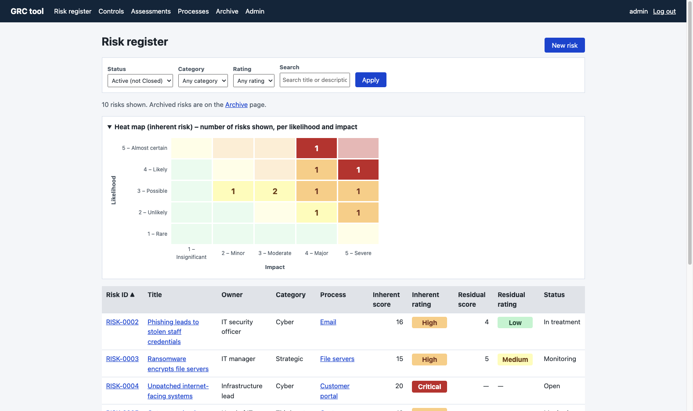
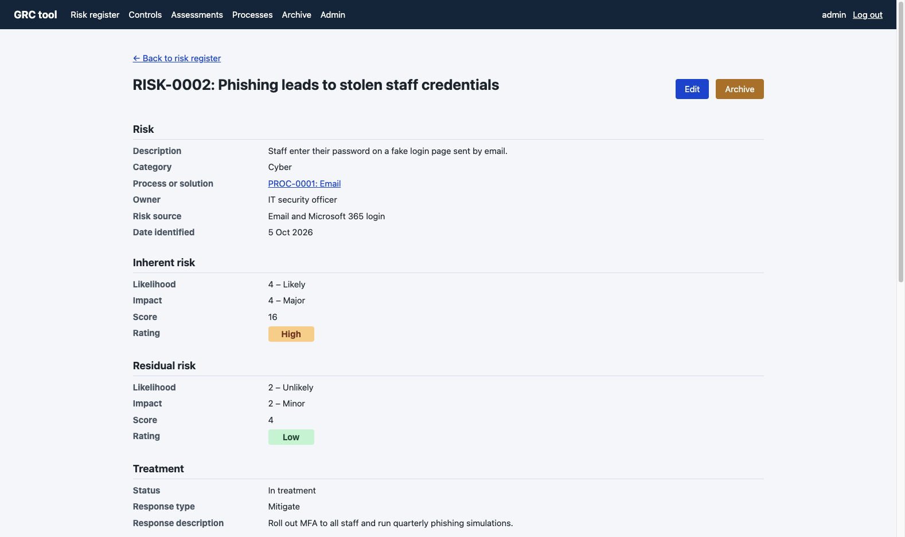
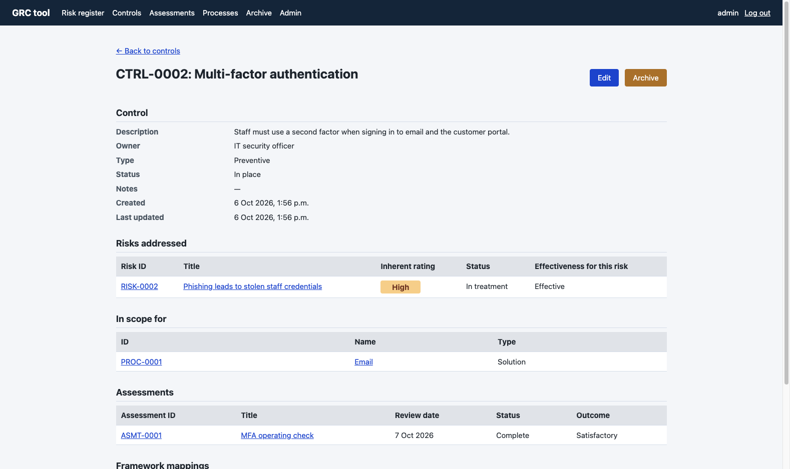
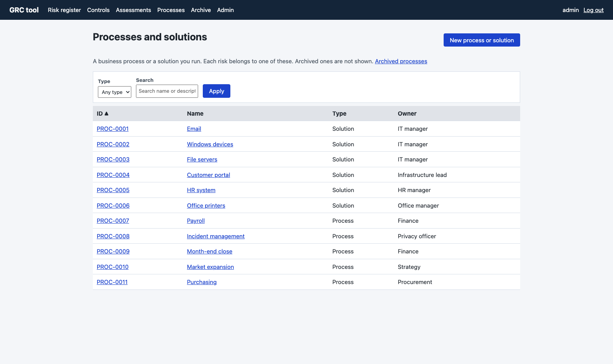
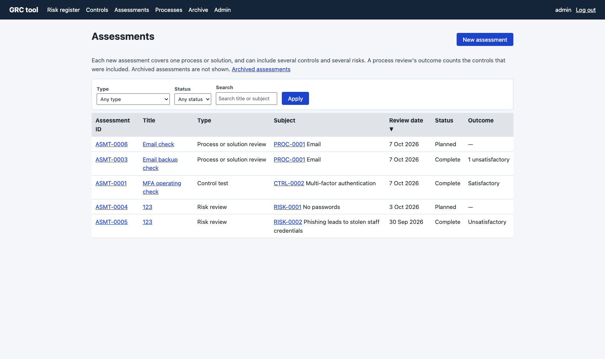
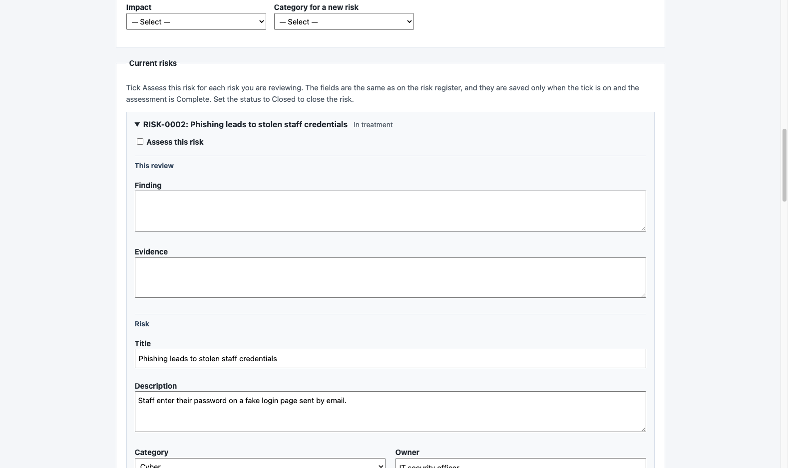

# GRC tool

A local tool for a risk register, controls, assessments, and the processes or solutions those risks belong to. It runs on your own computer. Each person who uses it gets their own empty database and their own login.

The screenshots below use made-up examples (phishing, backups, payroll), so you can see the screens. They are not a real organisation’s register.

## What you can do

- Keep a **risk register** with likelihood, impact, owner, treatment, and a heat map.
- Record **controls** (the safeguards) and link them to the risks they address.
- List **processes and solutions**, and put each risk on exactly one of them.
- Run an **assessment** of a process or solution: test several controls, review several current risks, or add a new risk, using the same fields as the register.
- **Archive** a record instead of deleting it. Closed and archived risks stay out of the default list.













## Run it on your computer

You need Python 3.14. Commands are run from the project folder.

```bash
python3 -m venv .venv
source .venv/bin/activate
pip install -r requirements.txt
cp .env.example .env
```

Open `.env` and set `SECRET_KEY` to a long random value:

```bash
python -c "import secrets; print(secrets.token_urlsafe(50))"
```

Then create the database and your login:

```bash
python manage.py migrate
python manage.py createsuperuser
python manage.py runserver
```

Open http://127.0.0.1:8000 and sign in. Stop the app with Ctrl+C.

Optional: `python manage.py load_sample_risks` loads the made-up examples. `python manage.py test` runs the checks.

## Your data stays yours

Cloning this project does not give anyone your register.

- The database file `grc.db` is never part of this repository. Real risks, controls, and assessments stay on the computer where you run the app.
- Dated copies from `python manage.py backup_db` stay in `backups/`, which is also left out.
- `.env` holds the secret key that protects logins. It is left out. `.env.example` only shows the names of the settings.
- The app answers only `127.0.0.1` and `localhost`, so it is not open to other machines on the network.
- Every page asks you to log in. There is no public page and no password-reset email.
- `DEBUG` defaults to off. Leave it off if the app is ever put on a shared server. The detailed error pages it turns on can reveal how the app is built.

Do not start the server on `0.0.0.0`. That would offer the app to every device that can reach the machine.

This is a tool you run yourself. It is not a hosted service, and nothing in the repository is a login to someone else’s register.
