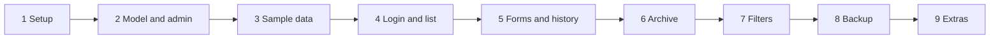

# Build plan: Risk Register (feature 1)

This document describes the chosen tech stack and the step-by-step plan for
building the first feature of the GRC tool: a risk register. No code has been
written yet. Each step below should be approved before it is built.

---

## 1. Tech stack decision

### Options considered

**Option A – Python + Flask + SQLite**

Flask is a small "micro-framework": it handles web pages and leaves everything
else to you.

- Pros
  - Very little to learn up front; a working page is a few lines of code.
  - Everything is explicit, so the code is easy to read line by line.
- Cons
  - Many things a GRC tool needs are *not* included: user logins, protection
    against form-forgery attacks (CSRF), database structure changes
    (migrations), form validation, an admin screen. Each one means adding an
    extra library or writing our own code – more code to own and more places
    for security gaps.
  - No standard way to organise multiple modules, so the structure has to be
    invented and kept consistent by hand as controls, TPRM, BIA etc. are added.

**Option B – Python + Django + SQLite** (recommended)

Django is a "batteries-included" framework: it ships with most building blocks
a business application needs.

- Pros
  - Built-in: user logins and permissions, an admin screen, form validation,
    database migrations, and protection against common attacks (SQL injection,
    CSRF, cross-site scripting) switched on by default. These act like
    baseline controls we don't have to design ourselves.
  - Each module lives in its own folder (Django calls this an "app"):
    `risks`, `controls`, `assessments`, `vendors` (TPRM), `bia`. This maps
    neatly onto the modules planned for the tool.
  - Linking things together (e.g. "this control mitigates these risks") is
    straightforward.
  - Very widely used and well documented, so help is easy to find.
  - Can move from SQLite to PostgreSQL later (for multi-user/server use) by
    changing a setting, not rewriting code.
- Cons
  - More concepts to learn at the start (models, views, templates, URLs,
    migrations).
  - Some behaviour happens "behind the scenes", which can feel less
    transparent than Flask. We'll offset this with comments.

### Recommendation

**Django + SQLite, with server-rendered HTML pages and a small plain CSS file.**
No JavaScript framework. Only one main dependency (Django itself).

Reasoning: a GRC tool will hold sensitive data, needs logins, and will grow
into several linked modules. Django provides those foundations ready-made and
tested, so we write less code and carry less security risk than assembling the
same things around Flask.

### Prerequisite: Python version

Current Django versions need Python 3.12 or newer. Python 3.14 is installed,
so this is met; Step 1 pins a Django version that officially supports 3.14. (macOS also ships an old Python 3.9 at `/usr/bin/python3`; always use
the project's virtual environment so the right version is used.)

---

## 2. Risk data model

A *model* is the definition of a database table: which fields a record has
and what values are allowed. Phase 1 has three tables: `Risk`, `RiskCategory`
and `RiskChange` (change history).

### Risk

| Field | Type | Rules |
|---|---|---|
| Risk ID | Text, e.g. `RISK-0001` | Generated automatically, unique, cannot be edited, never reused |
| Title | Short text | Required, max 200 characters |
| Description | Long text | Required |
| Category | Link to `RiskCategory` | Required; chosen from the pick-list |
| Owner | Short text | Required (person or role) |
| Risk source | Short text | Required; free text describing where the risk resides (e.g. a process, a solution/system) |
| Date identified | Date | Required; defaults to today |
| Inherent likelihood | Whole number | Required, 1–5 (Rare / Unlikely / Possible / Likely / Almost certain) |
| Inherent impact | Whole number | Required, 1–5 (Insignificant / Minor / Moderate / Major / Severe) |
| Inherent score | Whole number | Calculated: likelihood × impact (1–25), not editable |
| Inherent rating | Label | Derived from score: Low 1–4, Medium 5–9, High 10–16, Critical 17+ |
| Status | Choice list | Open / In treatment / Monitoring / Closed; default Open |
| Risk response type | Choice list | Optional while Open or Closed; required when In treatment or Monitoring. Mitigate / Accept / Transfer / Avoid |
| Risk response description | Long text | Required as soon as a response type is selected |
| Accepted by | Short text | Required when response type is Accept (person or role who signed off); otherwise empty |
| Acceptance date | Date | Required when response type is Accept; otherwise empty |
| Acceptance expiry date | Date | Required when response type is Accept; must be after the acceptance date; otherwise empty |
| Notes | Long text | Optional |
| Archived at | Date/time | Empty = active. Set automatically when archived; cleared on restore |
| Created at | Date/time | Set automatically on creation |
| Updated at | Date/time | Set automatically on every save |

The scoring fields are named *inherent* so they can't be mixed up with the
residual-risk fields that arrive with the controls module.

The score is calculated in code every time a risk is saved, so it can never
drift out of sync with likelihood and impact. The rating bands are kept in one
place in the code so they are easy to adjust later. Forms show each scale
value with its label, e.g. "3 – Possible", to keep scoring consistent.

**Validation lives in the model.** The rules above (ranges, required fields,
"response type needs a description") are defined in the model itself – the
central definition of a risk – so the admin screen and our own forms enforce
exactly the same rules. Likelihood and impact are also protected by database
constraints, as a second line of defence.

**Risk acceptance:** when the response type is Accept, the approver,
acceptance date and expiry date are all required, and the expiry date must
be after the acceptance date. For any other response type these fields must
be empty, so no stale acceptance data is left behind when the response
changes. An acceptance whose expiry date has passed is marked
"Acceptance expired" on the detail page and the list page, as a prompt to
re-review it.

**Archive instead of delete:** risks are never permanently deleted from the
app. Archiving is separate from status, so a risk keeps its last status
(e.g. Closed) after it is archived. A single "Archived at" field records both
*whether* and *when* a risk was archived, so the two can't disagree. A
retention rule (delete after X years) can be added later as its own step.

**Archived risks are read-only:** they cannot be edited – in our own pages
or in the admin screen – until they are restored. This keeps the archived
record as it was when it left scope.

### RiskCategory

| Field | Type | Rules |
|---|---|---|
| Name | Short text | Required, unique, max 100 characters |

Managed in the admin screen. A category that is still used by a risk cannot
be deleted. The starting categories – Cyber, Operational, Compliance, Third
party, Strategic and Financial – are loaded by the sample data command and
can be changed afterwards.

### RiskChange (change history)

One row per changed field, so the history reads like
"Likelihood 3 → 4 by W on 5 Oct".

| Field | Type | Rules |
|---|---|---|
| Risk | Link to `Risk` | Required |
| Field name | Short text | Which field changed (or the event: Created / Archived / Restored) |
| Old value | Text | Value before the change (empty for Created) |
| New value | Text | Value after the change |
| Changed by | Link to user | The logged-in user who made the change |
| Changed at | Date/time | Set automatically |

History rows are never edited or deleted. One shared helper
(`risks/history.py`) writes them, and both our own forms and the admin screen
use it, so no edit goes unrecorded.

---

## 3. Planned folder structure

```
grc-app/
├── manage.py              # Django's command-line helper (run server, migrations)
├── requirements.txt       # List of Python libraries the project needs
├── .env.example           # Template for secret settings (real .env is not committed)
├── config/                # Project-wide settings and URL routing
├── accounts/              # User-account table (shared by all modules)
├── risks/                 # The risk register module
│   ├── models.py          # Risk, RiskCategory and RiskChange tables; score calculation
│   ├── forms.py           # Input forms and validation rules
│   ├── views.py           # Logic for each page
│   ├── urls.py            # Web addresses for risk pages
│   ├── admin.py           # Risks and categories in Django's admin screen
│   ├── history.py         # Records change history (used by forms and admin)
│   ├── tests.py           # Automated checks
│   ├── management/commands/
│   │   ├── load_sample_risks.py  # Made-up sample data
│   │   └── backup_db.py          # Dated copy of the database
│   └── templates/risks/   # HTML pages
├── backups/               # Database backups (excluded from git)
├── templates/base.html    # Shared page layout (header, navigation)
├── static/css/style.css   # Styling
└── docs/plan.md           # This document
```

---

## 4. Build steps

Each step is sized to be built and tested in one chat session. Every step:

- adds its own automated tests (small scripts that check the code still does
  what it should), so problems show up straight away rather than at the end;
- ends with a **Check** you can do yourself, plus `python manage.py test`
  passing;
- ends with a git *commit* (a saved snapshot you can go back to).



### Step 1 – Environment and empty project
- Create a *virtual environment* (`.venv`): a private, per-project copy of
  Python so this project's libraries don't clash with anything else on the Mac.
- Install Django (pinned to an exact version that supports Python 3.14) and
  record it in `requirements.txt`.
- Create the Django project (`config/`) and the `risks` app.
- Set up Django's flexible user-account table *before* the first migration.
- Read secret settings (`SECRET_KEY`, `DEBUG`) from `.env` with a few lines of
  our own code; add `.env.example`.
- Name the database file `grc.db` so the `.gitignore` rule `*.db` keeps it out
  of git. (Django's default name, `db.sqlite3`, would *not* be ignored.)
- Fix `.gitignore`: add `!.env.example` (the rule `.env.*` would otherwise
  exclude the template) and `backups/`.
- Set time zone (Europe/Amsterdam) and date format.
- **Check:** `python manage.py runserver`, open http://127.0.0.1:8000 and see
  Django's welcome page. `git status` lists `.env.example` but not `.env` or
  `grc.db`.

### Step 2 – Risk and category model, admin screen
- Write the `Risk` and `RiskCategory` models (section 2), including the
  automatic Risk ID, score and rating calculation, scale labels and
  validation rules.
- Create and apply the first *migration* (a script that creates the database
  tables).
- Register both in Django's admin (Risk ID, score and rating read-only;
  archived risks fully read-only) and create your admin user.
- Tests: score and rating for edge values (1, 4, 5, 9, 10, 16, 20, 25), Risk
  ID generation, validation rules, the acceptance-field rules, and that an
  archived risk cannot be edited in the admin screen.
- **Check:** log in at http://127.0.0.1:8000/admin, add a category and a risk,
  and see the automatic ID, score and rating. Try likelihood 6, a response
  type with no description, and Accept without an approver: all three are
  rejected with a clear message.

### Step 3 – Sample data
- A command that loads the starting categories (Cyber, Operational,
  Compliance, Third party, Strategic, Financial) and ~10 made-up risks (no
  real organisational data), covering every rating and status. At least one
  sample risk has an expired acceptance. Running it again does not create
  duplicates.
- **Check:** `python manage.py load_sample_risks` twice; the admin shows the
  same ~10 risks, not 20.

### Step 4 – Login, layout, list and detail pages (read-only)
- Every page requires login, using Django's built-in login page.
- Shared layout (`base.html`) and simple CSS.
- **List page:** by default shows only Open, In treatment and Monitoring
  risks that are not archived (ID, title, owner, category, inherent score,
  rating, status), with colour-coded rating. Expired acceptances are flagged.
- **Detail page:** all fields of one risk, including an "Acceptance expired"
  flag where relevant.
- Tests: logged-out visitors are redirected; both pages load; Closed risks are
  not in the default list; the expired-acceptance flag appears.
- **Check:** open http://127.0.0.1:8000 while logged out and get sent to the
  login page; after logging in, see the sample risks and open one. A Closed
  sample risk does not appear in the list, and the risk with an expired
  acceptance is flagged.

### Step 5 – Create and edit forms, change history
- Create / Edit pages with the model's validation rules and clear error
  messages; scales shown with labels ("3 – Possible").
- `RiskChange` table and the shared history helper (`risks/history.py`),
  used by both our forms and the admin screen.
- History shown on the detail page, newest first.
- Tests: invalid input is rejected; an edit creates one history row per
  changed field; an admin edit is also recorded.
- **Check:** submit an empty form and see the error messages. Change a risk's
  likelihood from 3 to 4 and see "Likelihood 3 → 4" in its history.

### Step 6 – Archive and restore
- "Archive" button with a confirmation page, instead of delete.
- Archive page listing archived risks, each with a "Restore" button.
- Archiving and restoring are recorded in the history.
- Archived risks are read-only: no Edit button, and visiting the edit page
  directly is refused.
- Tests: archived risks are hidden from the register and shown on the archive
  page; restore brings them back; the edit page of an archived risk is
  refused.
- **Check:** archive a risk; it disappears from the register, appears on the
  archive page, and comes back when restored. Its history shows both events.
  While it is archived, try opening its edit page (copy the address from a
  non-archived risk's edit page and change the number): it is refused.

### Step 7 – Filters, search and sorting
- Filters for status, category and rating; a text search on title and
  description; sortable columns on the list page. The status filter includes
  "Closed" and "All" options, since Closed risks are hidden by default.
- Tests: each filter and the search return the right risks.
- **Check:** filter by High + Open, search for a word from a sample risk,
  sort by score. Choose "Closed" and see the Closed sample risk.

### Step 8 – Backup command
- `python manage.py backup_db` writes a dated copy, e.g.
  `backups/grc-2026-10-05-1400.db`, using SQLite's built-in backup feature
  (safe even while the app is running).
- **Check:** run the command; a new dated file appears in `backups/`, and
  `git status` does not list it.

### Step 9 – Optional extras (one per session, after the core is approved)
- 5×5 heat map on the list page (count of risks per likelihood/impact cell).
  **Check:** the cell counts match the register.
- Export the register to CSV (for reporting or audit evidence).
  **Check:** the file opens in Excel/Numbers with one row per active risk.

---

## 5. How this extends later

Each future module becomes its own Django app alongside `risks`:

- **controls** – controls linked to risks (many-to-many: one control can
  mitigate many risks and vice versa), and mapped to framework requirements
  (ISO 27001, NIST CSF, SOC 2).
- **assessments** – periodic risk/control reviews with findings, evidence and
  outcomes.
- **vendors (TPRM)** – third parties, their questionnaires and risk ratings,
  linked to risks.
- **bia** – business processes with RTO/RPO, dependencies and impact ratings.

**How links to risks work.** Links between risks and controls, vendors or
processes are stored in separate *linking tables* (one row per "this control
mitigates this risk") that belong to the new module. The `Risk` table itself
does not change. A linking table can also carry extra details, such as how
effective a control is for that particular risk. These links block deletion
of the risk they point to, which matches "archive, never delete".

**Added later, deliberately not now:**

- **Residual risk** (score after controls): added with the controls module,
  next to the existing *inherent* fields.
- **Owner** probably becomes a link to a "people" list rather than to a user
  account, because risk owners are people in the organisation, not users of
  this app.
- **Treatment actions** (several per risk, each with an owner and due date)
  become their own table.
- **Next review date** comes with the assessments module.
- **Risk appetite threshold** (e.g. "High or above needs extra sign-off to
  accept") may come with the controls or assessments phase.
- **Risk source** can be supplemented by links to processes (BIA), assets or
  vendors; the free text stays as context.

---

## 6. Risks and trade-offs

- **Learning curve:** Django has more concepts than Flask. Mitigation: plain
  comments in every file and explanations after each step.
- **SQLite is single-user/local:** fine for now; moving to PostgreSQL later is
  a configuration change.
- **Security:** the app runs only on your Mac (`127.0.0.1`), is not exposed to
  the network, keeps secrets in `.env`, and the database file is excluded from
  git. `DEBUG` mode must be turned off before any shared/server use.
- **Never start the server on `0.0.0.0`:** that would open the app to every
  device on your network. Always use the default `python manage.py runserver`.
- **`.gitignore` gap:** the rule `.env.*` also matches `.env.example`, so the
  template would never be committed. Step 1 adds `!.env.example` (meaning
  "except this file") and `backups/`.
- **Unencrypted database file:** SQLite does not encrypt data at rest. Rely
  on FileVault (macOS disk encryption) being enabled for now. Backups in
  `backups/` are unencrypted too, so the same applies to them.
- **Data loss:** all data lives in one file, `grc.db`. If it is lost or
  corrupted, everything is gone. Mitigation: the `backup_db` command (Step 8)
  plus Time Machine.

---

## 7. Decisions

- **Stack:** Django + SQLite (option B) – approved.
- **Python:** 3.14 installed. Django is pinned to an exact version that
  supports Python 3.14 in `requirements.txt`.
- **Scoring:** likelihood and impact record **inherent** risk (before
  controls). Residual risk (after controls) is added with the controls module.
- **Scale labels:** Likelihood 1–5 = Rare / Unlikely / Possible / Likely /
  Almost certain. Impact 1–5 = Insignificant / Minor / Moderate / Major /
  Severe.
- **Rating bands:** Low 1–4 / Medium 5–9 / High 10–16 / Critical 17 and above
  (on a 5×5 scale this means 20–25). May be adjusted later.
- **Status:** describes the lifecycle only: Open / In treatment / Monitoring /
  Closed. *How* a risk is treated is recorded in the response type, so the two
  can no longer contradict each other.
- **Risk response:** choice of Mitigate / Accept / Transfer / Avoid, with a
  mandatory explanation when a type is selected. A response type is required
  when the status is In treatment or Monitoring.
- **Risk acceptance:** when the response is Accept, "Accepted by",
  "Acceptance date" and "Acceptance expiry date" are required; the expiry
  date must be after the acceptance date; the fields stay empty for other
  response types. Expired acceptances are flagged in the register.
- **Categories:** a pick-list managed in the admin screen (not free text), so
  filtering and reporting stay consistent. Starting list: Cyber, Operational,
  Compliance, Third party, Strategic, Financial.
- **Default register view:** shows only Open, In treatment and Monitoring
  risks; Closed risks are reached through the status filter.
- **Dates:** "Date identified" is recorded. A next review date comes with the
  assessments module; treatment due dates come with treatment actions.
- **Risk source:** free text describing where the risk resides (process,
  solution/system, etc.). Can later be supplemented by links to processes,
  assets or vendors; the free text stays as context.
- **Change history:** part of the core build, recorded per field
  (e.g. "Likelihood 3 → 4 by W on 5 Oct"), so the audit trail starts on day one.
- **Deletion:** archive only; retention-based deletion (after X years) later.
- **Archived risks:** read-only (in our pages and the admin screen) until
  restored.
- **Backups:** a `backup_db` command writes a dated copy of the database to
  `backups/` (excluded from git).
- **Settings file:** `.env` is read by about 10 lines of our own code, so no
  extra library is needed and Django stays the only dependency.
- **User accounts:** Django's flexible ("custom") user-account setup is created
  in Step 1, before the database exists. Changing this later is painful.
